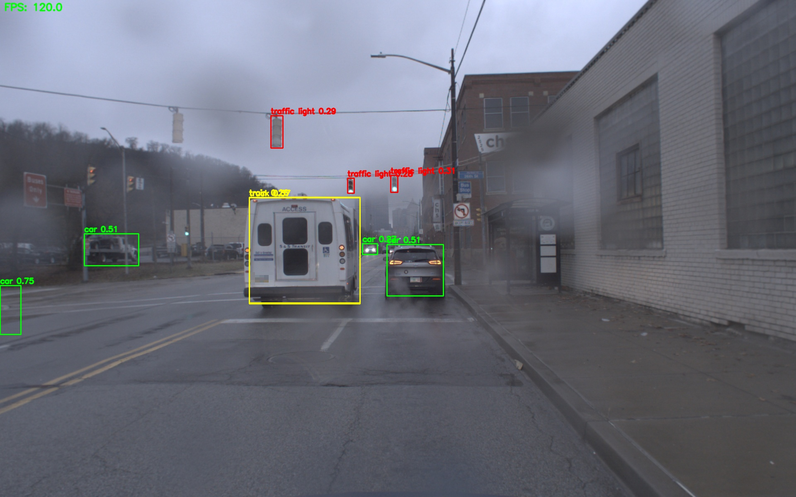
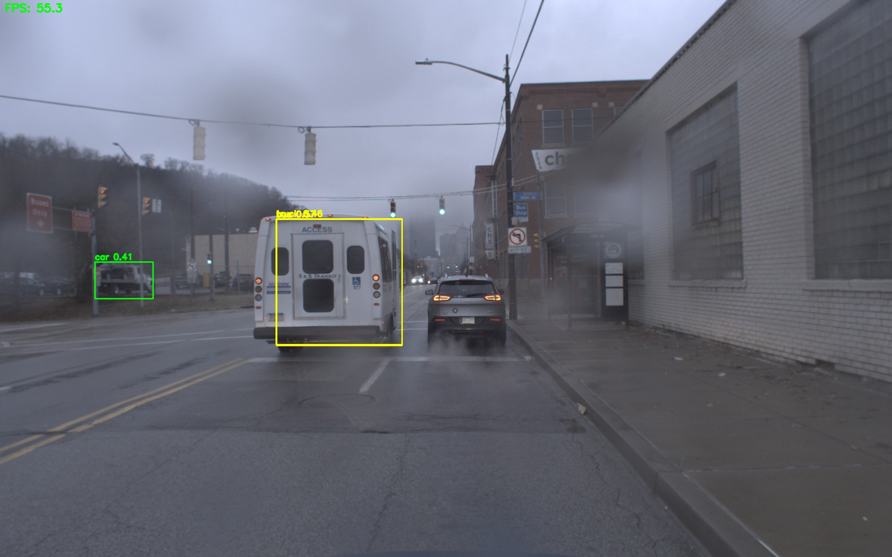

# ROS2 기반 비디오 인식 파이프라인 프로젝트

## 프로젝트 개요
이 프로젝트는 ROS2 (Iron) 환경에서 비디오 스트림을 받아 YOLO 기반 객체 검출 및 멀티 오브젝트 트래킹(MOT), 결과 Overlay, 저장까지의 파이프라인을 구현한 예제입니다. 실시간 인식 시스템의 구조와 동작 방식을 학습하고, 다양한 환경에서 손쉽게 개발 및 테스트할 수 있도록 설계되었습니다.

## 개발 및 실행 환경
- **Docker**: 개발 환경의 일관성을 위해 Docker 컨테이너(ros:iron-ros-base 이미지)에서 실행
- **VSCode**: 소스 코드 편집 및 원격 개발(Dev Containers)
- **Mac M3**: Apple Silicon(M3) 기반 Mac에서 개발 및 테스트
- **ROS2 Iron**: 최신 ROS2 Iron 배포판 기반

## 파이프라인 구조
```
[Publisher (Video/Image)] 
      ↓
[YOLO Inference Node] 
      ↓
[Overlay Node] 
      ↓
[MOT (Multi-Object Tracking) Node] 
      ↓
[Result Saver Node]
```
각 노드는 ROS2의 Publisher/Subscriber 구조로 메시지를 주고받으며, 각 단계별로 결과를 시각화하거나 저장할 수 있습니다.

## 주요 기능
- **Publisher**: 비디오 파일 또는 카메라 스트림을 ROS2 토픽으로 퍼블리시
- **YOLO 추론**: YOLO 모델을 이용해 입력 프레임에서 객체 검출
- **Overlay**: 검출 결과(바운딩 박스, 클래스 등)를 영상에 Overlay
- **MOT (Multi-Object Tracking)**: 객체 추적 알고리즘으로 각 객체의 ID 및 이동 경로 추적
- **저장**: 최종 결과 영상을 파일로 저장

## 실행 방법
1. **Docker 컨테이너 실행**
   ```bash
   docker compose up -d
   docker exec -it ros2_dev bash
   ```
2. **의존성 설치 및 빌드**
   ```bash
   cd ~/ros2_ws
   rosdep install --from-paths src --ignore-src -r -y
   colcon build
   source install/setup.bash
   ```
3. **노드 실행**
   - 퍼블리셔 실행:
     ```bash
     ros2 run video_publisher video_publisher_node --ros-args -p video_path:=/workspace/2025-08-26AM.mov
     ```
   - YOLO 노드 실행:
     ```bash
     ros2 run yolo_inference yolo_inference_node
     ```
   - Overlay, MOT, 저장 노드 등도 각각 실행 (예시 생략)

### 멀티 터미널 실행 순서 (Quick Start)

아래는 각 터미널에서 실행하는 명령어 예시입니다. 터미널을 여러 개 열어 각 단계별로 실행하세요.

#### 터미널 1 - 이미지 퍼블리셔 (둘 중 하나만 켜기)

**A) 데이터셋 퍼블리셔**
```bash
source /opt/ros/iron/setup.bash
source /workspace/install/setup.bash

python3 /workspace/src/image_pub_test.py
```

**B) 카메라 테스트 퍼블리셔 (ROS2 기본 제공)**
```bash
source /opt/ros/iron/setup.bash
source /workspace/install/setup.bash

ros2 run image_tools cam2image --ros-args \
  -p frequency:=10.0 \
  -p width:=1280 -p height:=720 \
  -r image:=/image_raw
```

검증:
```bash
ros2 topic hz /image_raw
```

---

#### 터미널 2 - YOLO 감지 노드
```bash
source /opt/ros/iron/setup.bash
source /workspace/install/setup.bash

ros2 run yolo_subscriber_py yolo_subscriber_py_node --ros-args \
  -p conf:=0.35 \
  -p imgsz:=416 \
  -p every_n:=2
```

검증:
```bash
ros2 topic hz /yolo/bounding_boxes
ros2 topic type /yolo/bounding_boxes   # my_msgs/msg/BoundingBoxes 나와야 정상
```

---

#### 터미널 3 - 오버레이/저장 노드
# (박스 색/라벨·FPS 오버레이 + 저장 옵션)
```bash
python3 /workspace/src/overlay_viz.py --ros-args \
  -p overlay_conf_min:=0.35 \
  -p show_fps:=true \
  -p save_mp4:=false \
  -p save_images:=false \
  -p save_boxes_csv:=true -p csv_path:=/workspace/out_boxes.csv \
  -p save_boxes_json:=true -p json_path:=/workspace/out_boxes.json
```

검증:
```bash
ros2 topic hz /image_yolo
```

---

#### 터미널 4 - 뷰어 (선택)
```bash
source /opt/ros/iron/setup.bash
source /workspace/install/setup.bash

ros2 run rqt_image_view rqt_image_view
```

---

#### 터미널 5 - MOT 트래커
```bash
source /opt/ros/iron/setup.bash
source /workspace/install/setup.bash

python3 /workspace/src/mot_node.py --ros-args \
  -p iou_th:=0.3 -p max_missed:=30 \
  -p save_dets_json:=true -p dets_json_path:=/workspace/dets.ndjson
```

검증:
```bash
source /opt/ros/iron/setup.bash
source /workspace/install/setup.bash

ros2 topic hz /tracks
```

---

#### 빠른 종료 & 정리
아래 명령어로 모든 노드를 한 번에 종료/정리할 수 있습니다:
```bash
pkill -f image_pub_test.py || true
pkill -f cam2image || true
pkill -f yolo_subscriber_py || true
pkill -f overlay_viz.py || true
pkill -f mot_node.py || true
```

## 결과 예시
아래는 파이프라인을 통해 처리된 결과 영상의 예시입니다.

- 검출된 객체에 바운딩 박스와 클래스 라벨, 추적 ID가 Overlay되어 표시됩니다.
- 결과 영상은 지정된 디렉토리에 mp4 파일로 저장됩니다.

### A/B 비교 예시
| A (frame_A003090.jpg) | B (frame_B003090.jpg) |
|---|---|
|  |  |

> 참고: 위 경로는 리포지토리 루트 기준입니다. `frame_A003090.jpg` / `frame_B003090.jpg` 파일이 저장소에 포함되어 있어야 GitHub에서 렌더링됩니다.


## 향후 계획
- YOLO 모델 경량화 및 속도 최적화
- 다양한 Tracking 알고리즘 지원(DeepSORT 등)
- Web UI를 통한 실시간 결과 모니터링 기능 추가
- 다양한 센서(예: LiDAR, Depth Camera)와의 통합
- 자동화된 테스트 및 배포 파이프라인 구축

---
문의 및 피드백은 Issues 또는 Pull Request로 남겨주세요.
